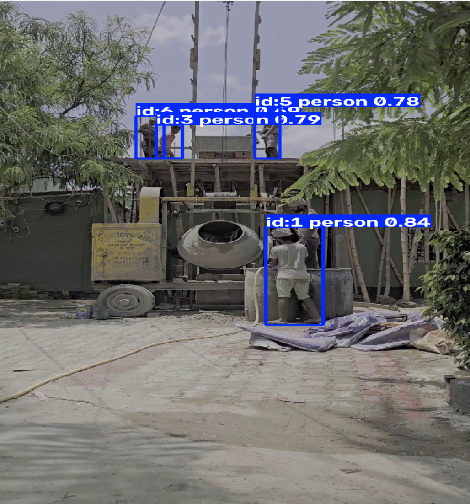
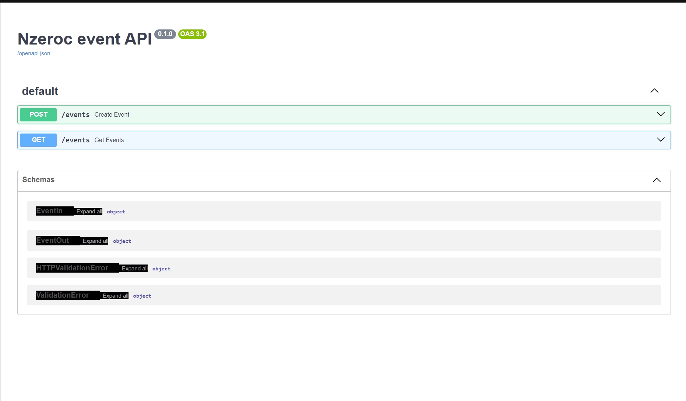
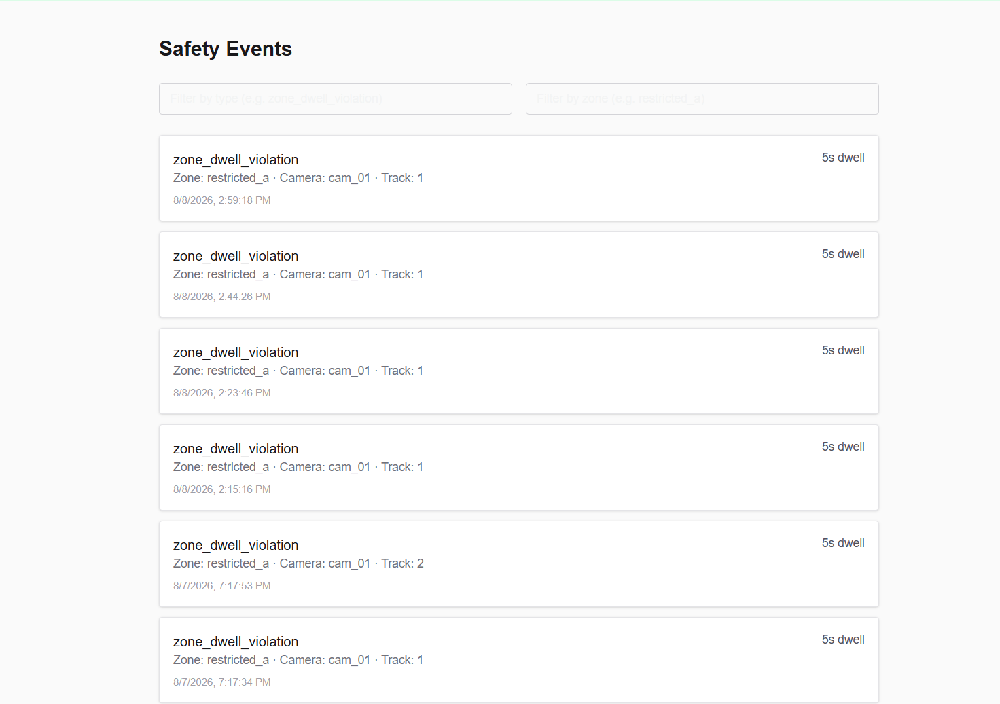

# NZeroC Take-Home Assessment — Krish Mittal

A three-layer safety pipeline: a Python Vision Agent that detects zone-dwell violations in video streams, a FastAPI + SQLite backend that stores and serves events idempotently, and a Next.js web dashboard that renders live events with filtering and cursor pagination.

## Screenshots

**Vision agent — detecting and tracking people, computing zone-dwell**


**Backend — FastAPI Swagger docs (`POST /events`, `GET /events`)**


**Frontend — live event feed pulling from the backend**


## Stack
- **Vision Agent**: Python 3.10+, OpenCV, Ultralytics YOLOv8n, ByteTrack
- **Backend API**: FastAPI, SQLAlchemy, SQLite, Pydantic v2
- **Frontend**: Next.js 16 (App Router), TypeScript, Tailwind CSS

---

## How to Run (In Order, From Clean Machine)

### 1. Backend Service
```bash
cd backend
python -m venv .venv
.venv\Scripts\Activate.ps1   # On Mac/Linux: source .venv/bin/activate
pip install -r requirements.txt
uvicorn app.main:app --reload
```
- API server runs on `http://localhost:8000`. Interactive docs at `http://localhost:8000/docs`.

### 2. Vision Agent
```bash
cd vision-agent
python -m venv .venv
.venv\Scripts\Activate.ps1
pip install -r requirements.txt
python agent.py
```
- Requires Backend running first — it posts detected violations live via HTTP.
- Place any test video as `clip2.mp4` inside `vision-agent/` (or update `VIDEO_PATH` in `agent.py`).
- Note: Model weights (`yolov8n.pt`) auto-download on first run. Video clips (`*.mp4`) are excluded from git.

### 3. Frontend Web Dashboard
```bash
cd frontend
npm install
npm run dev
```
- Dashboard runs on `http://localhost:3000`.

#### Frontend Environment Variables (`frontend/.env.local`)
Create `frontend/.env.local`:
```env
NEXT_PUBLIC_DATA_SOURCE=live
NEXT_PUBLIC_API_URL=http://localhost:8000
```

---

## Design Choices & Technical Rationale

### 1. Vision Agent Parameters
- **YOLOv8n Detector (`conf = 0.5`)**: Selected YOLOv8n (nano) for fast edge processing. A confidence threshold of `0.5` eliminates noise and false-positive detections while maintaining reliable tracking.
- **Dwell Threshold (`5 seconds`)**: Set to 5 seconds to ignore transient walk-throughs while alerting on lingering operators.
- **Movement Reset (`MOVEMENT_RESET_PX = 40`)**: Resets the dwell timer if a person moves more than 40 pixels between updates, distinguishing stationary lingerers from active workers walking through.
- **Dynamic Fractional Zone Scaling**: Zone boundaries use fractional image coordinates (`ZONE_FRACTION = (0.30, 0.50, 0.55, 0.95)`) auto-scaled via OpenCV video metadata (`CAP_PROP_FRAME_WIDTH/HEIGHT`), making the pipeline independent of video resolution.

### 2. Backend & Data Architecture
- **Idempotency Strategy**: Uses SQLite Primary Key (`id`) checks before insertion. Duplicate POST requests caused by edge retries return `200 OK` safely without producing duplicate database rows.
- **Cursor Pagination**: Uses `started_at` cursor sorting with a hard server-side limit (`le=50`). Cursor pagination avoids the row-skipping and duplicate rendering bugs inherent to offset pagination on live event feeds.

---

## What Each Piece Does (Plain Language Summary)

- **YOLOv8n** — Detects people in each video frame and draws bounding boxes around them.
- **ByteTrack** — Assigns persistent track IDs across consecutive frames to monitor how long someone stays in an area.
- **OpenCV** — Reads video frames and extracts video metadata like FPS and frame dimensions.
- **FastAPI** — Handles communication between the AI vision agent, database, and web frontend.
- **SQLAlchemy + SQLite** — Manages database connections and persists violation event records.
- **Next.js + TypeScript + Tailwind CSS** — Powers the web dashboard displaying safety violations with live mode banners, filter controls, and pagination.

---

## Anything Incomplete / What I'd Do Next With More Time

1. **Polygon Zone Mapping**: Upgrade 2D bounding rectangle checks to arbitrary polygon collision (`cv2.pointPolygonTest`).
2. **Asynchronous HTTP Queueing**: Send edge POST requests via background worker threads or asyncio queue so network latency never blocks the OpenCV video loop.
3. **WebSockets Push Feed**: Replace frontend poll/pagination with WebSockets (`ws://`) for instant real-time alert popups.
